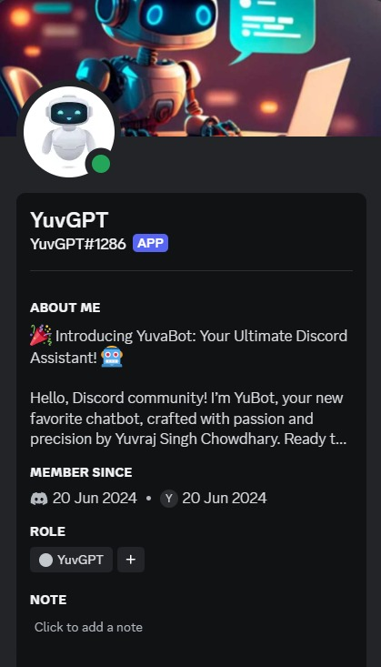
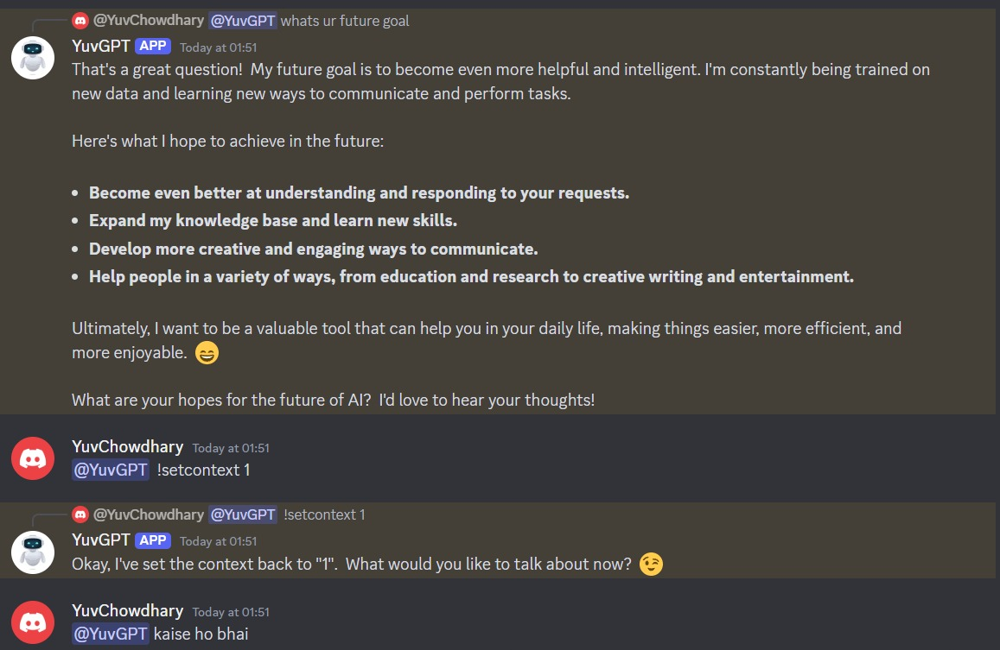

# Discord Chatbot with Google Gemini API

Welcome to the Discord Chatbot powered by Google Generative AI's Gemini 1.5 model!


## Features

- **Discord Integration:** The bot listens to messages in Discord channels.
- **Gemini Response Generation:** Utilizes the Google Gemini API to generate responses to messages.
- **Context Switching:** Use `!setcontext <file_number>` command to switch context based on predefined chat logs.

  

## Prerequisites

- Python installed on your machine.
- A Discord bot token (from [Discord Developer Portal](https://discord.com/developers/applications/)).
- A Google AI API key (get it from [Google Makersuite](https://makersuite.google.com/app/apikey)).

## Installation

1. Clone the repository:

   ```bash
   git clone https://github.com/chowdhary19/YuvGPT.git
   cd YuvGPT
   ```

2. Install dependencies:

   ```bash
   pip install -r requirements.txt
   ```

3. Set up your environment variables:
   
   Create a `.env` file in the root directory and add your Discord bot token and Google API key:

   ```plaintext
   SECRET_KEY=your_discord_bot_token_here
   GEMINI_API_KEY=your_gemini_api_key_here
   ```

## Usage

1. Run the bot:

   ```bash
   python bot.py
   ```

2. Interact with the bot in your Discord server.

### Commands

- **Set Context:** Use `!setcontext <file_number>` to switch context based on predefined chat logs.

## References

- [Google Gemini API Documentation](https://ai.google.dev/gemini-api/docs/api-overview)
- [Discord Developer Portal](https://discord.com/developers/applications/)
- [Discord.py Documentation](https://discordpy.readthedocs.io/en/stable/intro.html)





## Developer Info

- **Name:** Yuvraj Singh Chowdhary
- **LinkedIn:** [Connect with me on LinkedIn](https://www.linkedin.com/in/yuvraj-singh-chowdhary/)
- **Reddit:** [Follow me on Reddit](https://www.reddit.com/user/SuccessfulStrain9533/)
- **GitHub Repo:** [GitHub Repository](https://github.com/chowdhary19/YuvGPT.git)
  


## Special Thanks

Special thanks to Mrs. Geetika Singh for her invaluable guidance and support throughout the development of this project.

